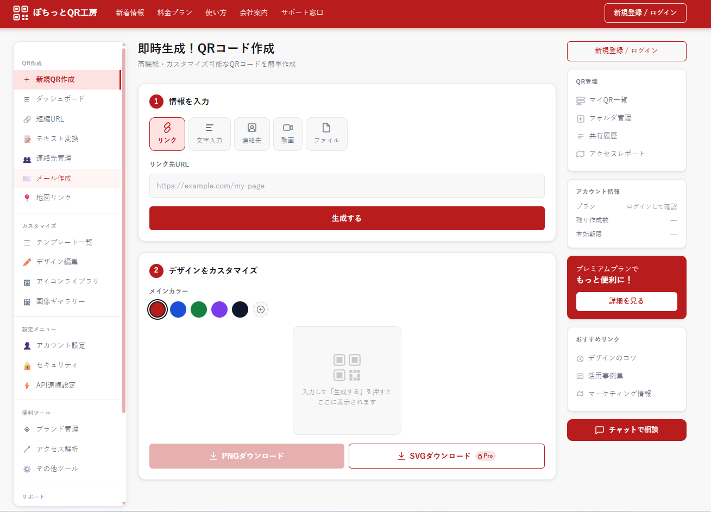

# cmalu.com — Privacy-first browser tools

Three web tools that never upload your files. Everything runs in the browser.

**Live at [cmalu.com](https://cmalu.com)**



| Tool | What it does | URL |
|---|---|---|
| **QR generator** | URL, text, vCard, email and map QR codes. Logo embedding, colour customisation, framed output, and a decoder. | [cmalu.com/qr/](https://cmalu.com/qr/) |
| **Image compressor** | Batch-compress JPEG, PNG and WebP. Up to 50 files at once. | [cmalu.com/img/](https://cmalu.com/img/) |
| **PDF merger** | Merge PDFs, reorder pages by dragging, exclude pages you don't need. | [cmalu.com/pdf/](https://cmalu.com/pdf/) |

---

## Why "never upload"

Every tool here processes files entirely in the browser. Nothing is sent to a
server, because there is no server — the whole site is static.

That means a document you cannot legally send to a third party is still safe to
use here. No account, no upload, no retention.

This is not a policy promise. It is a property of the architecture: the site has
no backend to receive a file in the first place.

---

## Security

The site ships a strict Content-Security-Policy and a set of hardening headers
from [`_headers`](_headers):

```
default-src 'self'; script-src 'self' <analytics> <cdn>; worker-src 'self' blob:;
img-src 'self' data:; frame-ancestors 'none'; base-uri 'self'; object-src 'none'
```

Notes on decisions that took some working out:

- **`img-src` allows `data:` but not `blob:`.** Canvas output is converted with
  `FileReader.readAsDataURL()` rather than `URL.createObjectURL()`, because the
  blob form was blocked in production while working locally.
- **`worker-src 'self' blob:`** is required for the PDF tool — pdf.js renders
  page thumbnails in a Web Worker, and without this the document load hangs
  silently rather than failing.
- **A single CSP for the whole site.** Cloudflare Pages *appends* per-path rules
  rather than replacing them, so splitting the policy per directory results in
  two CSP headers being sent and evaluated together.

Input handling:

- URLs are validated by scheme — only `http:` and `https:` are accepted, since
  `new URL()` happily parses `javascript:`.
- vCard fields are escaped per RFC 6350, so a newline in a name field cannot
  inject additional vCard properties.
- The image tool caps total pixels, not just file size, because a small PNG can
  decompress into gigabytes of canvas memory.
- Contact-type QR history is stored redacted; the content is never written to
  `localStorage`.

---

## Stack

No framework, no build step. HTML, CSS and vanilla JavaScript, served as static
files from Cloudflare Pages.

| | |
|---|---|
| QR generation | qrcodejs, qr-code-styling |
| QR decoding | jsQR |
| PDF | pdf-lib (editing), pdf.js (rendering) |
| Hosting | Cloudflare Pages |

Vendored libraries live under each tool's `js/vendor/`.

---

## Layout

```
index.html          landing page
qr/                 QR generator (26 pages) + css, js, img
img/                image compressor
pdf/                PDF merger
_headers            security headers
sitemap.xml         25 URLs
```

## Running locally

No build step — serve the directory over HTTP:

```bash
python -m http.server 8000
```

Opening the files directly with `file://` will not work: the tools load
libraries and workers with paths that require an HTTP origin.

---

_Ideas, concepts, proofreading and editing: cmalu ractu_
_Text generation: Claude (Anthropic)_
